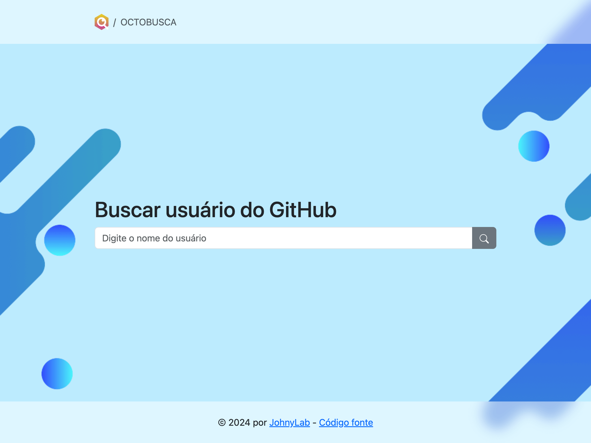
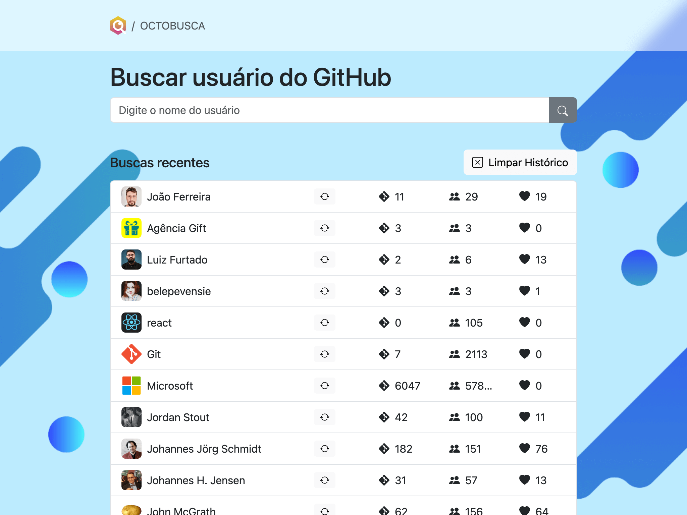
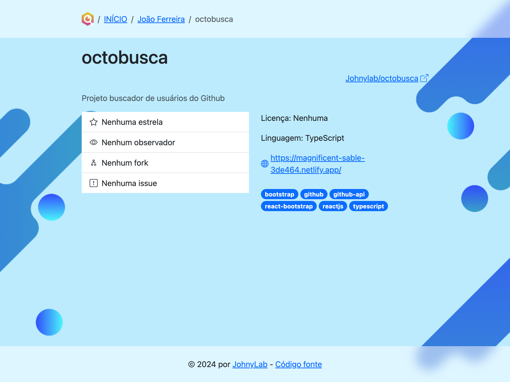

# OctoBusca

Este é um projeto client-side construído em [React](https://react.dev/), utilizando [react-router](https://reactrouter.com/), [Typescript](https://www.typescriptlang.org/) e [Bootstrap](https://getbootstrap.com/) para criar uma aplicação que consulta a [API do GitHub](https://docs.github.com/pt/rest?apiVersion=2022-11-28) para mostrar os repositórios mais populares de um determinado usuário. Embora eu seja expert em CSS, o aplicativo foi personalizado com o mínimo de estilos possível, priorizando o uso de classes utilitárias, de acordo com recomendações na [documentação do Bootstrap](https://getbootstrap.com/docs/5.3/getting-started/introduction/).

O projeto está hospedado no Netlify e pode ser acessado aqui: [OCTOBUSCA: Buscar Usuário do GitHub](https://magnificent-sable-3de464.netlify.app/).

## Rodando este projeto na máquina local

1. Certifique-se de ter o Node.js instalado (https://nodejs.org/en/download/current).
2. Clone o repositório executando `git clone https://github.com/Johnylab/octobusca` no terminal ou [baixe o código aqui](https://github.com/Johnylab/octobusca).
3. Navegue até a pasta do projeto e execute `npm install` para instalar as dependências.
4. Inicie o projeto com `npm start`.
5. Abra o aplicativo no navegador. Verifique a resposta do terminal para obter o link (geralmente é http://localhost:5173/).

## Funcionalidades

### Tela Inicial (HomeScreen)

Permite buscar por um usuário do GitHub.



Quando uma busca retorna um usuário, algumas informações são mostradas junto com o link para ver mais detalhes.


As buscas feitas anteriormente são salvas e mostradas embaixo do campo de busca. Além de ser útil para o usuário, os dados salvos ajudam a evitar que o limite da API do GitHub seja atingido muito rapidamente.



### Tela do Usuário (UserScreen)

Exibe os detalhes do usuário buscado, incluindo o número de seguidores, número de seguidos, imagem do avatar, e-mail, biografia, etc.

Lista os repositórios desse usuário, ordenados pelo número decrescente de estrelas por padrão. A lista de repositórios pode ser ordenada por mais e menos estrelas, observadores ou forks.


### Tela do Repositório (RepoScreen)

Apresenta detalhes de um repositório, incluindo nome, descrição, número de estrelas, linguagem e um link externo para a página do repositório no GitHub.

Pode ser acessado clicando na listagem dos repositórios na tela anterior (UserScreen).



## Organização do Projeto

O projeto segue uma estrutura organizada para facilitar o desenvolvimento e manutenção. Seguem algumas convenções:

A pasta `/src/screens/` contém as páginas renderizadas pelo `RouterProvider` definido em `/src/Routes.tsx`.

A pasta `/src/components/` contém uma pasta para cada página (sem o sufixo 'Screen'), contendo os componentes de interface de usuário de cada uma. Diferente dos componentes em `screens`, os componentes de IU não acessam a API `Context` diretamente e possuem o mínimo de lógica possível. Todos os dados são recebidos através de `props`. Além disso, `components` também contém os componentes do layout (container principal, cabeçalho e rodapé) e outros componentes de interface. Utilitários que não renderizam componentes ficam na pasta `/src/utils/` classificados em arquivos por categoria (tipo de dado ou API específica que manipulam).

Exemplo:

```tsx
// src/components/Home/SearchForm.tsx

type SearchFormProps = {
  onSubmit: (username: string) => void;
  isLoading?: boolean;
};

function SearchForm({ onSubmit, isLoading = false }: SearchFormProps) {
  const [username, setUsername] = useState('');

  function onSearchInput(e: ChangeEvent<HTMLInputElement>) {
    setUsername(e.target.value);
  }

  function onSearchSubmit(e: FormEvent) {
    e.preventDefault();
    onSubmit(username);
  }

  return (
    <Container className="my-3">
      <h1>Buscar usuário do GitHub</h1>

      <Form onSubmit={onSearchSubmit}>
        <InputGroup>
          <FormControl
            type="text"
            placeholder="Digite o nome do usuário"
            value={username}
            onInput={onSearchInput}
          />
          <Button variant="secondary" type="submit" disabled={isLoading}>
            <Search aria-label="Pesquisar" />
          </Button>
        </InputGroup>
      </Form>
    </Container>
  );
}
```

A pasta `/src/github/` contém as constantes, tipos e utilitários de acesso à API do GitHub e ao armazenamento local (`localStorage`). As pastas `/src/assets/` e `/src/context/` contêm arquivos estáticos e as definições de uso da API `Context`, respectivamente, conforme as convenções da comunidade.

## Consumo de APIs

As APIs utilizadas no projeto são:

- Detalhes de um usuário: `https://api.github.com/users/{username}`
- Repositórios de um usuário: `https://api.github.com/users/{username}/repos`
- Detalhes de um repositório: `https://api.github.com/repos/{full_name}` *

\* Esta última se mostrou redundante durante o desenvolvimento da interface com a API.

Exemplo:

```ts
// src/github/api.ts

async function fetchUserData(username: string): Promise<UserData> {
  try {
    const userResponse = await fetch(`https://api.github.com/users/${username}`);
    const userProfile = await userResponse.json();
    return userProfile;
  } catch (err) {
    return { message: err.message };
  }
}
```

## Limites de taxa da API do GitHub

https://docs.github.com/pt/rest/using-the-rest-api/rate-limits-for-the-rest-api?apiVersion=2022-11-28

Conforme a documentação da API (veja o link acima), o limite para requisições não autenticadas é de 60 requisições por hora por IP. Testar a aplicação no início do desenvolvimento foi difícil. Alguns minutos salvando alterações no código já causaram o estouro do limite. Eu pensei primeiro em gerar um token de autenticação ou um Github App para poder aumentar o limite, mas não poderia expor nenhum token no frontend, e criar um servidor só pra acessar a API fugiria do escopo do projeto.

A solução que eu decidi implementar foi um sistema de "cache" armazenando as buscas feitas no computador do usuário. Com isso, os dados salvos possibilitaram a exposição do histórico de busca em uma lista acessível para o usuário na página inicial, melhorando a experiência do usuário.

Adicionalmente, o usuário pode recarregar os dados de um item do histórico clicando no ícone de recarregar em cada linha ou apagar todos os dados armazenados clicando no botão "Limpar Histórico".

## Últimas considerações

- O logo do aplicativo e a imagem de fundo foram editados a partir de imagens vetoriais fornecidas pelo [Freepik](https://www.freepik.com/)
- Todas as edições de imagens foram feitas com o [Inkscape](https://inkscape.org/pt-br/).
- As imagens foram otimizadas no [TinyPNG](https://tinypng.com/).
- As capturas de tela foram feitas com o comando "Capture Screenshot" do painel DevTools do Google Chrome (pressione F12 para ver).
